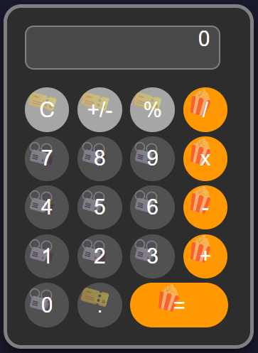

# 1 - Calculator. HTML/CSS <!-- omit in toc -->

> Лабораторная работа 1 для студентов курса "Проектирование сетевых приложений" 4 семестра кафедры ИУ5 МГТУ им Н.Э. Баумана.

## Содержание <!-- omit in toc -->

- [Цель работы](#цель-работы)
- [Начало работы](#начало-работы)
- [Задание](#задание)
- [Указания по выполнению лабораторной работы](#указания-по-выполнению-лабораторной-работы)
    - [Требования к реализации](#требования-к-реализации)
- [Пример программы](#пример-программы)
- [Результат работы](#результат-работы)

## Цель работы

Знакомство с инструментами построения пользовательских интерфейсов web-сайтов: HTML, CSS. В ходе выполнения работы, вам предстоит ознакомиться с кодом реализации простого калькулятора, и затем выполнить задания по варианту.

---

## Начало работы

Зайдите в свою локальную директорию с репозиторием для выполнения лабораторных работ. Заберите ветку с соответствующей лабораторной работой из общего репозитория:

```sh
git pull upstream
```

**или**

```sh
git pull upstream lab_1
```

Переключитесь на ветку с текущей лабораторной работой:

```sh
git checkout lab_1
```

Свяжите ветку локального репозитория с вашим удаленным репозиторием:

```sh
git push --set-upstream origin lab_1
```

## Задание

Создание калькулятора. Верстка на HTML, CSS. Копировать 3-5 основных цветов кодами с сайта по вашей теме (хедер, фон, карточки, кнопки, hover) и еще 2-3 свойства (padding и тд)

---
## Указания по выполнению лабораторной работы
1. Все изменения вносятся в файлы calculator.html и style.css
2. CSS-правила добавляются в существующий файл стилей
3. HTML-элементы добавляются в существующую структуру калькулятора
4. Для проверки открывайте файл в браузере после каждого изменения

---

## Требования к реализации
1. Работа должна быть выполнена в файлах calculator.html и style.css
2. Все изменения должны быть реализованы с использованием только HTML и CSS (допускается минимальное использование JavaScript для пунктов 12, 17)
3. Калькулятор должен сохранять свою основную функциональность (кнопки должны нажиматься, результат отображаться)
4. Внешний вид должен быть уникальным и не повторяться с работами других студентов


## Пример программы

Важные HTML теги, использованные в работе

```html
<!-- Основная структура -->
<div class="calculator">           <!-- Контейнер калькулятора -->
<div class="result">0</div>        <!-- Поле вывода результата -->
<div class="buttons">              <!-- Контейнер для кнопок -->

<!-- Кнопки с разными классами -->
<button class="my-btn secondary">C</button>    <!-- Вторичные кнопки -->
<button class="my-btn primary">/</button>      <!-- Основные кнопки операций -->
<button class="my-btn execute">=</button>      <!-- Кнопка выполнения -->

<!-- Переключатель темы -->
<button id="themeToggle" class="theme-toggle">
    <span id="themeIcon">🌙</span>
</button>

<!-- Ссылки -->
<a href="index.html" class="menu-link">Главная</a>
```
Переключение темы 

```javascript
function toggleTheme() {
    const currentTheme = document.documentElement.getAttribute('data-theme');
    const themeIcon = document.getElementById('themeIcon');

    if (currentTheme === 'light') {
        document.documentElement.setAttribute('data-theme', 'dark');
        themeIcon.textContent = '🌙';
        localStorage.setItem('theme', 'dark');
    } else {
        document.documentElement.setAttribute('data-theme', 'light');
        themeIcon.textContent = '☀️';
        localStorage.setItem('theme', 'light');
    }
}
```
Основные свойства

```css
.my-btn {
    padding: 0;                    /* Внутренний отступ */
    height: 50px;
    width: 50px;
    border-radius: 20px;          /* Скругление углов кнопок */
}

.calculator {
    padding: 25px;                /* Внутренний отступ калькулятора */
    border: 3px solid var(--calc-border);
    border-radius: 20px;          /* Скругление углов калькулятора */
}

.result {
    padding: 20px;                /* Внутренний отступ поля результата */
    margin-bottom: 20px;          /* Внешний отступ снизу */
    border-radius: 20px;
}

.buttons>div {
    gap: 8px;                     /* Расстояние между кнопками */
}
```
---

## Результат работы



---