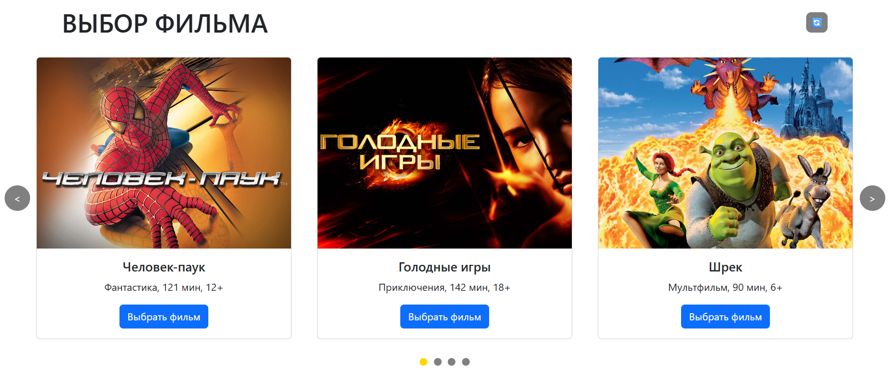

# 3 - Простое веб-приложение. Верстка <!-- omit in toc -->

> Лабораторная работа 3 для студентов курса "Проектирование сетевых приложений" 4 семестра кафедры ИУ5 МГТУ им Н.Э. Баумана.

## Содержание <!-- omit in toc -->

- [Цель работы](#цель-работы)
- [Начало работы](#начало-работы)
- [Задание](#задание)
- [Указания по выполнению лабораторной работы](#указания-по-выполнению-лабораторной-работы)
    - [Структура проекта](#структура-проекта)
	- [Требования к реализации](#требования-к-реализации)
- [Пример программы](#пример-программы)
- [Результат работы](#результат-работы)

## Цель работы

Знакомство с node, npm, написание простого приложения на JavaScript. В ходе выполнения работы, вам предстоит ознакомиться с кодом реализации простого интерфейса и вывода данных, и затем выполнить задания по варианту

---

## Начало работы

Зайдите в свою локальную директорию с репозиторием для выполнения лабораторных работ. Заберите ветку с соответствующей лабораторной работой из общего репозитория:

```sh
git pull upstream
```

**или**

```sh
git pull upstream lab_3
```

Переключитесь на ветку с текущей лабораторной работой:

```sh
git checkout lab_3
```

Свяжите ветку локального репозитория с вашим удаленным репозиторием:

```sh
git push --set-upstream lab_3
```

## Задание

1. Создать двухстраничное приложение из примера по вариантам
2. Вариант состоит из темы и компонента, который необходимо использовать
3. Все данные должны соответствовать выбранной теме
4. Компонент можно применить по своему усмотрению

---
## Указания по выполнению лабораторной работы

1. Инициализировать проект через npm init и установить Bootstrap
2. Создать классы MainPage и ProductPage с перерисовкой контейнера #root
3. Вынести компоненты (карточка, кнопка назад) в папку components/
4. Данные для карточек хранить в массиве в методе getData()
5. Реализовать лайтбокс с навигацией по стрелкам клавиатуры

---

### Структура проекта


---

### Требования к реализации

1. Код должен быть написан на JavaScript (ES6+) с использованием модулей (import / export)
2. Проект должен быть инициализирован через npm init
3. Установлен и подключен Bootstrap через npm
4. Страницы должны быть реализованы в виде классов (MainPage, ProductPage)
5. Компоненты должны быть переиспользуемыми и храниться в папке components/
6. Данные для карточек должны быть вынесены в отдельный массив в методе getData()
7. При переходе между страницами должен перерисовываться только контейнер #root
8. Поддержка открытия страницы продукта по ID карточки

---

## Пример программы

Переход на страницу планеты и рендер главной страницы

```javascript
export class MainPage {
    clickCard(cardId) {
        const planetPage = new PlanetPage(this.parent, cardId);
        planetPage.render();
    }

    render() {
        this.parent.innerHTML = '';
        const html = this.getHTML();
        this.parent.insertAdjacentHTML('beforeend', html);

        const container = document.getElementById('planets-container');
        const data = this.getData();

        data.forEach((item) => {
            const planetCard = new PlanetCardComponent(container);
            planetCard.render(item, this.clickCard.bind(this));
        });
    }
}
```
Обработка клика по заголовку карточки и открытие лайтбокса при клике на изображение

```javascript
// pages/main/index.js - MainPage
export class MainPage {
    renderCarousel() {
        const track = document.getElementById('carouselTrack');
        const data = this.getData();
        
        for (let i = 0; i < 3; i++) {
            const movie = data[(this.currentIndex + i) % data.length];
            const cardDiv = document.createElement('div');
            cardDiv.style.flex = "0 0 300px";
            
            // Создаём карточку фильма
            const card = new ProductCardComponent(cardDiv);
            card.render(movie, (e) => {
                // При клике на кнопку переходим на страницу фильма
                new ProductPage(this.parent, e.target.dataset.id).render();
            });
            
            track.appendChild(cardDiv);
        }
    }
}
```
Страница фильма с кнопкой назад

```javascript
// pages/product/index.js - ProductPage
export class ProductPage {
    clickBack() {
        // Возвращаемся на главную страницу
        const mainPage = new MainPage(this.parent);
        mainPage.render();
    }

    render() {
        this.parent.innerHTML = '';
        const html = this.getHTML();
        this.parent.insertAdjacentHTML('beforeend', html);

        const data = this.getData();
        
        // Отображаем информацию о фильме
        const stock = new ProductComponent(this.pageRoot);
        stock.render(data);

        // Добавляем кнопку "Назад"
        const backButton = new BackButtonComponent(this.pageRoot);
        backButton.render(this.clickBack.bind(this));
    }
}
```
Компонент кнопки назад

```javascript
// components/back-button/index.js
export class BackButtonComponent {
    getHTML() {
        return `
            <button id="back-button" class="btn btn-primary" type="button">Назад</button>
        `;
    }

    addListeners(listener) {
        // Навешиваем обработчик клика на кнопку
        document
            .getElementById("back-button")
            .addEventListener("click", listener);
    }

    render(listener) {
        const html = this.getHTML();
        this.parent.insertAdjacentHTML('beforeend', html);
        this.addListeners(listener);
    }
}
```

---

## Результат работы




---